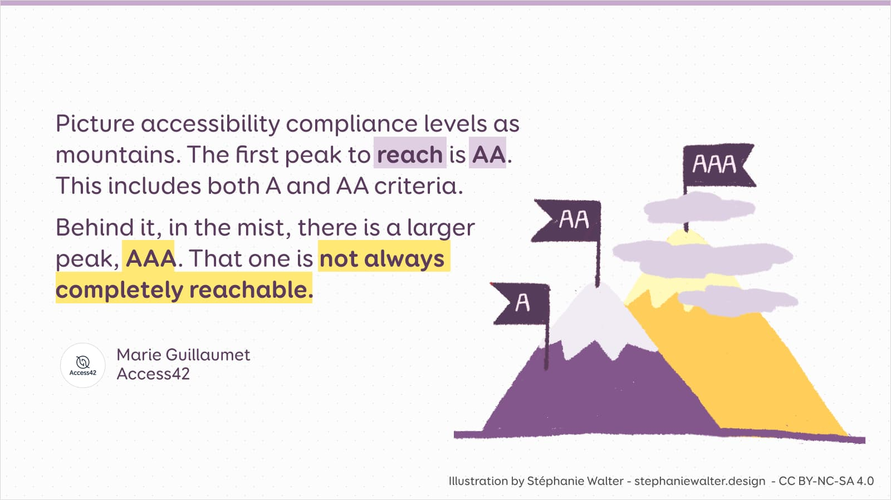

# Jupyter Accessibility Statement

## Jupyter audits

This section includes audits from different stakeholders on Jupyter products.

- [JupyterLab v2.2.6 WCAG 2.1](https://github.com/jupyterlab/jupyterlab/issues/9399)
- [Jupyter Notebook WCAG 2.0](https://github.com/jupyter/accessibility/issues/7)
- [JupyterLab v3.4.5 400% Zoom Audit](https://github.com/Quansight-Labs/jupyterlab-accessible-themes/issues/34)

## Accessibility Statement for JupyterLab

Edited from the [W3C accessibility statement generator](https://www.w3.org/WAI/planning/statements/generator/#create)

This is an accessibility statement from Jupyter accessibility contributors.

### The current state of JupyterLab

Jupyter accessibility statements are living documents. This statement was created on 16 May 2022 using the [W3C Accessibility Statement Generator Tool](https://www.w3.org/WAI/planning/statements/) with additions and edits from the Jupyter accessibility contributors community.

```{note}
This statement was last updated 16 June 2022.
```

#### Conformance status

The [Web Content Accessibility Guidelines (WCAG)](https://www.w3.org/WAI/standards-guidelines/wcag) defines requirements for designers and developers to improve accessibility for people with disabilities. It defines three levels of conformance: Level A, Level AA, and Level AAA. JupyterLab is nonconforming with WCAG 2.1 level AA. Nonconforming means that the content does not meet the accessibility standard.



_By [Stéphanie Walter](https://stephaniewalter.design) ([Source](https://stephaniewalter.design/blog/5-illustrations-to-understand-and-promote-accessibility/))_

JupyterLab's accessibility does not exist in isolation. JupyterLab inherits much from the many projects it is built upon and its accessibility conformance may impact projects built off of JupyterLab or its components. The accessibility of this ecosystem is interlinked, so conformance may need to be resolved at different levels in order to impact JupyterLab positively.

#### Compatibility with browsers and assistive technology

JupyterLab is designed to be compatible with the following

Operating systems:

- Windows
- macOS
- Linux
- iOS
- Android

Browsers (mobile and desktop):

- Firefox
- Chrome
- Safari
- Chromium browsers

JupyterLab is not compatible with:

Operating systems:

Browsers (mobile and desktop):

- Internet Explorer
- Edge

Assistive technology:

- JAWS
- NVDA
- VoiceOver
- Narrator
- Orca screen readers
- voice control technology

#### Technical specifications

Accessibility of JupyterLab relies on the following technologies to work with the particular combination of web browser and any assistive technologies or plugins installed on your computer:

- HTML
- WAI-ARIA
- CSS
- JavaScript

These technologies are relied upon for conformance with the accessibility standards used.

#### Limitations and alternatives

Despite our best efforts to ensure accessibility of JupyterLab, there may be some limitations. Below is a description of known limitations, and potential solutions. Please contact us if you observe an issue not listed below.

**Known limitations for JupyterLab:**

1. **Documents**: Documents written by the community may not include accessible content because we do not and cannot review every document that can be opened and edited in JupyterLab. To support accessible documents, we are drafting guidelines for accessible document content with an emphasis on Jupyter notebooks. Please report the issue to the author and [open an issue on jupyter/accessibility](https://github.com/jupyter/accessibility/issues/new) describing the problem and the behavior you expect so we may integrate it into our content guidelines.
2. **JupyterLab extensions**: JupyterLab extensions written by the community may not be accessible because JupyterLab extensions can be written by anyone in the community and have no standard review process. We do not and can not review every JupyterLab extension. To support accessible extensions, we encourage extension authors to use existing, accessible JupyterLab components for their extensions. We also provide periodic opportunities for community education on accessibility. Please report the issue to the author and let them know the [jupyter/accessibility](https://github.com/jupyter/accessibility/) community may be able to provide guidance.

#### Assessment approach

Jupyter accessibility contributors assessed the accessibility of JupyterLab by the following approaches:

- Self-evaluation
- Regular automated testing to monitor for regressions (can be found at [jupyter/accessibility](https://github.com/jupyter/accessibility)
- User feedback

#### Evaluation report

An evaluation for JupyterLab is available at: [jupyterlab/jupyterlab/issues/9399](https://github.com/jupyterlab/jupyterlab/issues/9399).

User reports on JupyterLab's accessibility are available at:[the jupyterlab/jupyterlab label `tag:accessibility`](https://github.com/jupyterlab/jupyterlab/labels/tag%3AAccessibility).

### What the community is doing

#### Measures to support accessibility

Jupyter accessibility contributors take the following measures to ensure accessibility of JupyterLab:

- Include accessibility as part of our mission statement.
- Provide continual accessibility training for our community.
- Assign clear accessibility goals and responsibilities.
- Employ formal accessibility quality assurance methods.
- Document changes, approaches, and improvements to the above methods and to JupyterLab itself.

```{tip}
For more information on current efforts to improve JupyterLab's accessibility, visit the [CZI - JupyterLab accessibility grant roadmap](https://jupyter-a11y.netlify.app/roadmap/intro.html).
```

### Feedback and Formal complaints

We welcome your feedback and formal complaints on the accessibility status of JupyterLab.
Please let us know if you encounter accessibility barriers on JupyterLab:

- [Write an issue on jupyter/accessibility](https://github.com/jupyter/accessibility/issues/new)
- [Write an issue on jupyterlab/jupyterlab](https://github.com/jupyterlab/jupyterlab/issues/new) and request it be labeled [`tag:Accessibility`](https://github.com/jupyterlab/jupyterlab/labels/tag%3AAccessibility)
- If you are interested in being part of any potential research or organized feedback initiatives, please [send an email with the subject line `Jupyter Accessibility Feedback` here](mailto:ipresedo@quansight.com). Gauging community interest in user research participation helps us gain the support to make it happen.

```{warning}
At the time of writing, there is no non-public way to contact us for JupyterLab accessibility issues.
```

Please note that JupyterLab is an open-source project and that Jupyter accessibility contributors are a group defined on a voluntary basis. Like many other open-source projects, we cannot guarantee how long it may take to respond to and resolve an issue, though we do make an effort to do it as quickly as is possible with our resources.
Thanks for your patience and understanding.
